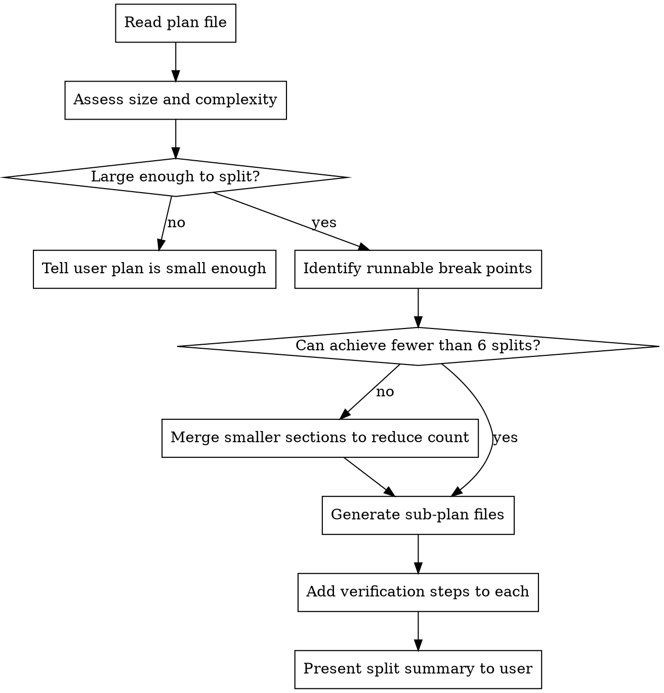

# Plan Splitter

## Overview

Read an existing plan file, assess whether it's large enough to benefit from splitting, identify natural break points where the application is in a runnable and verifiable state, and produce separate plan files — each independently executable with its own verification steps.

**Core principle:** Each sub-plan must leave the application in a working, testable state. Never split mid-feature where the app would be broken.

## When to Use

- Plan has more than 8 tasks or exceeds ~200 lines of implementation steps
- Plan covers multiple independent subsystems or features
- Execution accuracy is dropping because the plan is too large for one context window
- User explicitly asks to break up a plan

**When NOT to use:**
- Plan has fewer than 5 tasks — it's already small enough
- Tasks are tightly coupled and cannot be separated without breaking the app
- Plan is already structured as independent phases with clear boundaries

## The Process



### Step 1: Read and Assess

Read the plan file. Evaluate:

1. **Task count** — How many discrete tasks are there?
2. **Total implementation lines** — How much code/instruction content?
3. **Coupling** — Which tasks depend on outputs of previous tasks?
4. **Subsystem boundaries** — Are there natural groupings by feature or module?

**Decision:** If the plan has fewer than 5 tasks and under ~150 lines of implementation steps, tell the user the plan is small enough to execute as-is. Stop here.

### Step 2: Identify Break Points

A valid break point is a boundary between tasks where:

- All code written so far compiles/runs without error
- The application can be started and exercised (manually or via tests)
- The changes made so far are independently valuable (not half a feature)
- Tests for the completed work can pass

**How to find them:**

1. Walk through tasks in order
2. After each task, ask: "If I stopped here, could I run the app and verify these changes work?"
3. Group tightly-coupled tasks that must ship together (e.g., a migration + the code that uses it)
4. Mark boundaries where the answer to #2 is "yes" and the grouping from #3 is satisfied

### Step 3: Determine Split Count

**Target: fewer than 6 sub-plans.** Reasons:

- More than 6 creates coordination overhead that defeats the purpose
- Each sub-plan should be substantial enough to be worth its own execution session
- Fewer splits = fewer integration risk points

If you identified more than 5 break points, merge adjacent small sections until you have 3-5 sub-plans. Prefer merging sections that share files or modules.

### Step 4: Generate Sub-Plan Files

For each sub-plan, create a new file alongside the original:

**Naming:** `{original-name}-part-{N}.md` where N is 1, 2, 3...

**Location:** Same directory as the original plan file.

**Each sub-plan contains:**

```markdown
# [Feature Name] — Part N of M: [Section Title]

> **For agentic workers:** REQUIRED SUB-SKILL: Use superpowers:subagent-driven-development
> (recommended) or superpowers:executing-plans to implement this plan task-by-task.

**Goal:** [What this part specifically accomplishes]

**Prerequisites:** [What must be completed before this part — reference prior parts]

**Starting state:** [What the codebase looks like when this part begins]

---

[Tasks from the original plan, renumbered starting at 1]

---

## Verification

After completing all tasks in this part, verify:

- [ ] Application starts without errors
- [ ] [Specific verification step 1 — tailored to what was built]
- [ ] [Specific verification step 2]
- [ ] All tests pass: `[exact test command]`
- [ ] Changes committed with descriptive message
```

### Step 5: Write Verification Steps

For each sub-plan, write concrete verification steps that prove the work in that section is complete and correct. These should be:

- **Specific** — not "verify it works" but "run `make test` and confirm 0 failures"
- **Runnable** — commands the executor can copy-paste
- **Observable** — describe what correct output looks like
- **Cumulative** — later parts should verify they haven't broken earlier parts

Examples of good verification steps:
- "Run `curl localhost:5000/health` and confirm 200 response"
- "Run `pytest tests/test_api.py -v` — all tests pass, including the new `test_webhook_export`"
- "Start the app with `make run`, navigate to /dashboard, confirm the new chart renders"
- "Run the full test suite `make run-tests` — no regressions from Part 1"

### Step 6: Present Summary

After writing all sub-plan files, present a summary to the user:

```
Plan split into N parts:

1. **Part 1: [title]** — [1-sentence summary] (N tasks)
2. **Part 2: [title]** — [1-sentence summary] (N tasks)
...

Files created:
- docs/superpowers/plans/feature-name-part-1.md
- docs/superpowers/plans/feature-name-part-2.md
...

Execute in order. Each part leaves the app in a working state.
Ready to start with Part 1?
```

## Splitting Heuristics

**Good break points:**
- After a new module/file is fully implemented with tests
- After a migration + its dependent code are both done
- After an API endpoint is complete end-to-end
- After a refactoring step that doesn't change behavior
- After infrastructure/setup tasks (config, dependencies, scaffolding)

**Bad break points:**
- Between a type definition and the code that uses it
- Between a database migration and the queries that depend on it
- Between an interface definition and its implementation
- In the middle of a multi-step refactoring that has intermediate broken states
- Between a feature flag and the feature it gates

## Common Mistakes

| Mistake | Fix |
|---------|-----|
| Splitting too granularly (8+ parts) | Merge adjacent sections that share modules |
| Breaking mid-feature | Group coupled tasks — split only at runnable boundaries |
| Vague verification ("check it works") | Write exact commands with expected output |
| Missing prerequisites section | Each part must state what prior parts provide |
| Duplicating shared context | Put shared setup in Part 1; later parts reference it |
| Forgetting regression checks | Later parts should re-run earlier verification |

## Integration

**Works with:**
- **superpowers:writing-plans** — Creates the plans this skill splits
- **superpowers:executing-plans** — Executes each sub-plan independently
- **superpowers:subagent-driven-development** — Execute sub-plans with fresh subagent context
